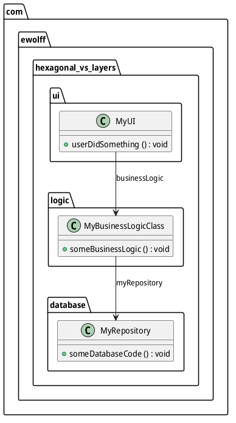
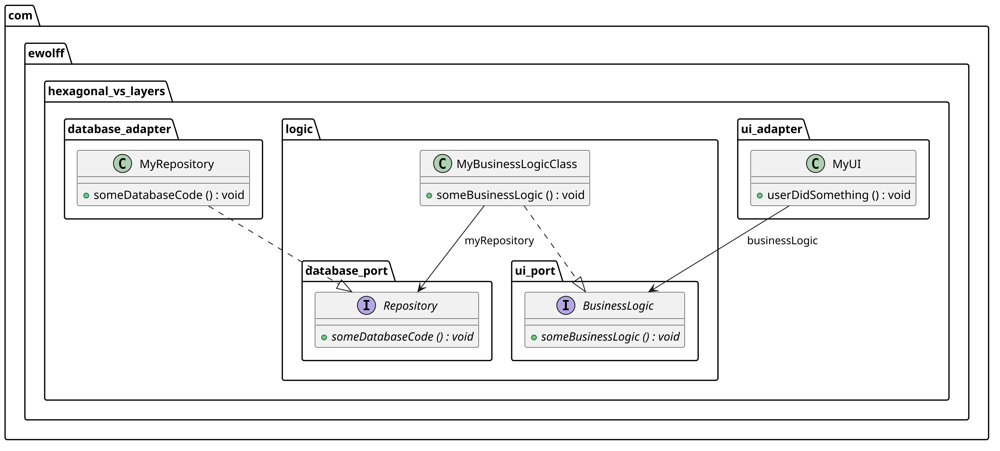

# Hexagonal-vs.-Layers-Beispiel in Java

Dies ist ein extrem vereinfachtes Java-Projekt, das den Unterschied
zwischen einer geschichteten Architektur (Layered Architecture) und
einer hexagonalen Architektur zeigt. Ich habe es in einem Workshop
verwendet und es schien trotz seiner Einfachheit nützlich zu sein.

## Kompilieren und Ausführen

Verwende `mvn test`, um beide Beispiele zu bauen und zu testen. Die
Tests prüfen, ob das System funktioniert und ob die Architektur
korrekt umgesetzt ist (siehe unten).

## Layer-Architektur

Das UI-Paket verwendet das Logic-Paket, welches wiederum das
Database-Paket verwendet.

Problem: Logic hängt von Database ab – das wirkt nicht besonders
sauber. Tatsächlich kann diese Abhängigkeit den Austausch der
Database-Schicht erschweren. Beispielsweise könnten spezifische
Database-Exceptions in Logic verwendet und behandelt werden. Für Tests
könnte es notwendig sein, Database durch einen Mock zu ersetzen, was
aufgrund der Abhängigkeiten schwierig sein kann.

## Hexagonale Architektur

Wenn wir das Interface für Database extrahieren und in Logic
verschieben, hängt Database von Logic ab. Um deutlicher zu machen,
warum die hexagonale Architektur auch „Ports and Adapters“ genannt
wird, befindet sich das Interface in `logic.database_port` und die
Implementierung in `database_adapter`.

Für das UI wird ein Interface in `logic.ui_port` definiert. Dieses
wird von `ui_adapter` verwendet, um die Geschäftslogik aufzurufen.

## ArchUnit

Um die Abhängigkeiten zu erzwingen, wird
[ArchUnit](https://www.archunit.org/) verwendet.

Für die Layer-Architektur stellt der
[ArchitectureTest](layers/src/test/java/com/ewolff/hexagonal_vs_layers/ArchitectureTest.java)
sicher:

* Logic greift auf Database zu
* Logic greift nicht auf UI zu
* UI greift nur auf Logic zu

Für die hexagonale Architektur stellt der
[ArchitectureTest](hexagonal/src/test/java/com/ewolff/hexagonal_vs_layers/ArchitectureTest.java)
sicher:

* Logic greift nicht auf Database zu
* Logic greift nicht auf UI zu
* UI-Adapter greift nur auf den UI-Port in Logic zu
* Database-Adapter greift nur auf den Database-Port in Logic zu

ArchUnit bietet außerdem eine [fluent
API](https://www.archunit.org/userguide/html/000_Index.html#_getting_started)
für komplexere Regeln. Sowohl Layer-Architektur als auch
Onion-Architektur (auch bekannt als hexagonale Architektur) sind
außerdem
[vordefiniert](https://www.archunit.org/userguide/html/000_Index.html#_architectures).

## Klassendiagramm generieren

Du kannst die Klassendiagramme mit dem Skript `generate-diagram.sh`
generieren. Es erwartet, dass PlantUML unter
`~/Downloads/plantuml-1.2026.6.jar` vorhanden ist.

## Links

* [Komplexeres Beispiel von Tom Hombergs](https://github.com/thombergs/buckpal)
